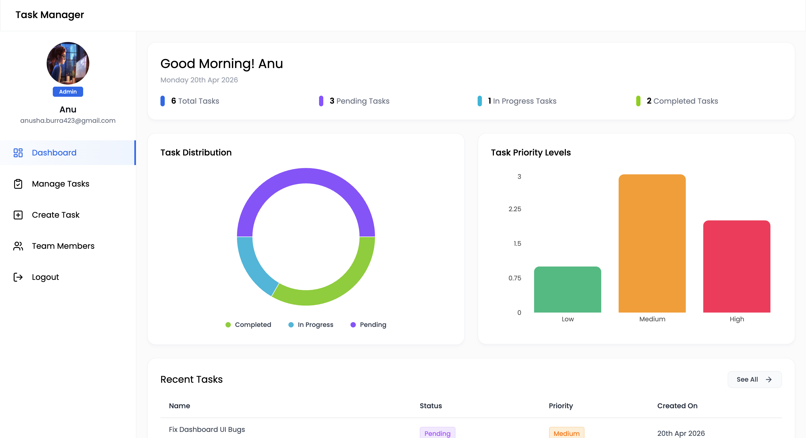
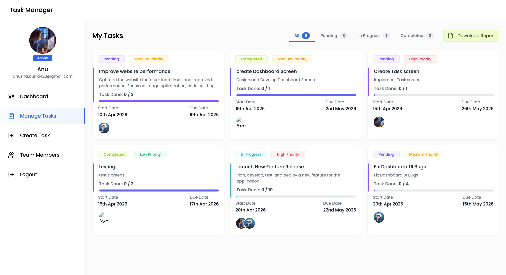
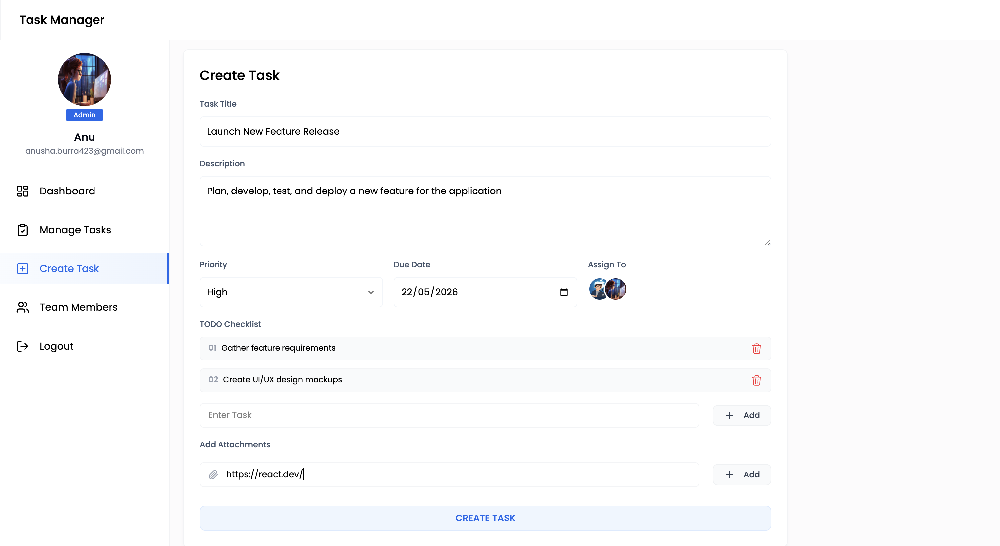

# 📋 Task Manager App

A fully responsive, full-stack **Task Management Application** built with the **MERN stack** (MongoDB, Express.js, React, Node.js). Designed for teams to collaborate, track tasks, and manage priorities efficiently — with both **User** and **Admin** roles.

---
## 📸 Screenshots
| Dashboard | Manage Tasks | Create Task |
|-----------|-----------|-------------|
|  |  |  |

---
## ✨ Features

### 🔐 Authentication
- JWT-based Login & Signup
- Role-based access: **Admin** and **User**
- Protected routes and secure token handling

### 📊 User Dashboard
- View all assigned tasks at a glance
- Track task progress with visual indicators
- Get insights on pending, in-progress, and completed tasks

### ✅ Task Management
- Create, update, and delete tasks
- Set due dates and priority levels (Low / Medium / High)
- Add attachments via file links
- Checklist-based progress tracking

### 🔄 Automated Status Updates
- Task status automatically updates based on checklist completion
- Real-time progress reflection without manual intervention

### 👥 Team Collaboration
- Assign tasks to one or multiple team members
- Track individual and team completion status
- Admin can oversee all tasks across the team

### 🎯 Priority & Progress Tracking
- Categorize tasks by priority
- Visual progress bars and completion percentages
- Filter and sort tasks by status, priority, or due date

### 📥 Task Report Downloads
- Export task data for analysis
- Download reports for individual or all tasks

### 📎 Attachments Support
- Add file links to tasks
- Quick access to task-related documents and resources
---

## 🛠️ Tech Stack

| Layer | Technology |
|-------|-----------|
| Frontend | React.js, Tailwind CSS |
| Backend | Node.js, Express.js |
| Database | MongoDB, Mongoose |
| Auth | JWT (JSON Web Tokens) |
| State Management | Context API |
